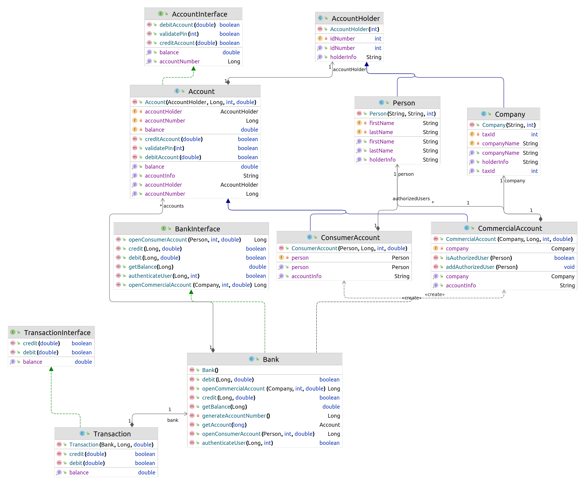

# SimpleBankingApp

A simple banking application implemented in Java with support for consumer and commercial accounts. This application includes account management, transactions, and user authentication. The project follows an object-oriented design and is tested using JUnit.

## Features

- Create consumer and commercial accounts
- Authenticate users
- Credit and debit accounts
- Manage authorized users for commercial accounts

## Class Diagram

The UML class diagram for this application is as follows:



## Installation

1. Clone the repository:
    ```sh 
    git clone https://github.com/SamzyTechSolutions/Simple-Banking-App.git
    ```
2. Navigate to the project directory:
    ```sh
    cd Simple-Banking-App
    ```
3. Open the project in your preferred IDE (e.g., IntelliJ IDEA, Eclipse).

## Usage

### Creating Accounts

```java
import bank.*;

public class Main {
    public static void main(String[] args) {
        Bank bank = new Bank();

        // Create a consumer account
        Person samuelAdiela = new Person("Samuel", "Adiela", 1);
        Long consumerAccountNumber = bank.openConsumerAccount(samuelAdiela, 1234, 500.0);

        // Create a commercial account
        Company samzyTech = new Company("Samzy Tech", 123456);
        Long commercialAccountNumber = bank.openCommercialAccount(samzyTech, 5678, 1000.0);
    }
}
```

### Managing Accounts

```java
import bank.*;

public class Main {
    public static void main(String[] args) {
        Bank bank = new Bank();

        // Create a consumer account
        Person samuelAdiela = new Person("Samuel", "Adiela", 1);
        Long consumerAccountNumber = bank.openConsumerAccount(samuelAdiela, 1234, 500.0);

        // Authenticate user
        boolean isAuthenticated = bank.authenticateUser(consumerAccountNumber, 1234);

        // Credit and debit operations
        bank.credit(consumerAccountNumber, 200.0);
        bank.debit(consumerAccountNumber, 150.0);

        // Check balance
        double balance = bank.getBalance(consumerAccountNumber);
        System.out.println("Balance: " + balance);
    }
}
```

### Account Operations

```java
import bank.*;

public class Main {
    public static void main(String[] args) {
        Bank bank = new Bank();

        // Create a consumer account
        Person samuelAdiela = new Person("Samuel", "Adiela", 1);
        Long consumerAccountNumber = bank.openConsumerAccount(samuelAdiela, 1234, 500.0);

        // Get the account
        Account account = bank.getAccount(consumerAccountNumber);

        // Credit the account
        account.creditAccount(200.0);
        System.out.println("Balance after credit: " + account.getBalance());

        // Debit the account
        boolean isDebited = account.debitAccount(150.0);
        System.out.println("Debit successful: " + isDebited);
        System.out.println("Balance after debit: " + account.getBalance());

        // Validate PIN
        boolean isPinValid = account.validatePin(1234);
        System.out.println("Is PIN valid: " + isPinValid);
    }
}
```

### Commercial Account Operations

```java
import bank.*;

public class Main {
    public static void main(String[] args) {
        Bank bank = new Bank();

        // Create a commercial account
        Company samzyTech = new Company("Samzy Tech", 123456);
        Long commercialAccountNumber = bank.openCommercialAccount(samzyTech, 5678, 1000.0);

        CommercialAccount commercialAccount = bank.getAccount(commercialAccountNumber);
        Person blessingAdiela = new Person("Blessing", "Adiela", 2);
        commercialAccount.addAuthorizedUser(blessingAdiela);

        // Check if a user is authorized
        boolean isAuthorized = commercialAccount.isAuthorizedUser(blessingAdiela);
        System.out.println("Is Blessing Adiela authorized? " + isAuthorized);
    }
}
```

### Consumer Account Operations

```java
import bank.*;

public class Main {
    public static void main(String[] args) {
        Bank bank = new Bank();

        // Create a consumer account
        Person samuelAdiela = new Person("Samuel", "Adiela", 1);
        Long consumerAccountNumber = bank.openConsumerAccount(samuelAdiela, 1234, 500.0);

        // Authenticate user
        boolean isAuthenticated = bank.authenticateUser(consumerAccountNumber, 1234);
        System.out.println("User authenticated: " + isAuthenticated);

        // Credit the account
        bank.credit(consumerAccountNumber, 200.0);
        System.out.println("Balance after credit: " + bank.getBalance(consumerAccountNumber));

        // Debit the account
        boolean isDebited = bank.debit(consumerAccountNumber, 150.0);
        System.out.println("Debit successful: " + isDebited);
        System.out.println("Balance after debit: " + bank.getBalance(consumerAccountNumber));

        // Check balance
        double balance = bank.getBalance(consumerAccountNumber);
        System.out.println("Final balance: " + balance);
    }
}
```

### Transaction Operations

```java
import bank.*;

public class Main {
    public static void main(String[] args) {
        Bank bank = new Bank();

        // Create a consumer account
        Person samuelAdiela = new Person("Samuel", "Adiela", 1);
        Long consumerAccountNumber = bank.openConsumerAccount(samuelAdiela, 1234, 1000.0);

        // Create a transaction
        Transaction transaction = new Transaction(bank, consumerAccountNumber, 1234);

        // Check balance
        double balance = transaction.getBalance();
        System.out.println("Initial balance: " + balance);

        // Credit the account via transaction
        transaction.credit(200.0);
        System.out.println("Balance after credit: " + transaction.getBalance());

        // Debit the account via transaction
        boolean isDebited = transaction.debit(150.0);
        System.out.println("Debit successful: " + isDebited);
        System.out.println("Balance after debit: " + transaction.getBalance());
    }
}
```

## Testing

JUnit tests are provided to verify the functionality of the application. To run the tests:

1. Open the project in your preferred IDE.
2. Run the test classes located in the `src/test/java` directory.

### Test Classes

- `BankTest`
- `AccountTest`
- `ConsumerAccountTest`
- `CommercialAccountTest`
- `TransactionTest`

## Author
Samuel Rich Adiela

## Contributing

Contributions are welcome! Please fork the repository and submit a pull request with your changes. Make sure to include tests for any new features or bug fixes.

### Directory Structure

```
Simple-Banking-App/
├── src/
│   ├── main/
│   │   ├── java/
│   │   │   ├── Account.java
│   │   │   ├── AccountHolder.java
│   │   │   ├── Bank.java
│   │   │   ├── CommercialAccount.java
│   │   │   ├── Company.java
│   │   │   ├── ConsumerAccount.java
│   │   │   ├── Person.java
│   │   │   ├── Transaction.java
│   └────────── interfaces/
│   │   │   │   ├── AccountInterface.java
│   │   │   │   ├── BankInterface.java
│   │   │   │   ├── TransactionInterface.java
│   ├── test/
│   │   ├── java/
│   │   │   ├── AccountTest.java
│   │   │   ├── BankTest.java
│   │   │   ├── CommercialAccountTest.java
│   │   │   ├── ConsumerAccountTest.java
│   │   │   ├── TransactionTest.java
├── .gitignore
├── pom.xml
├── README.md
└── UMLDiagram.png
```
